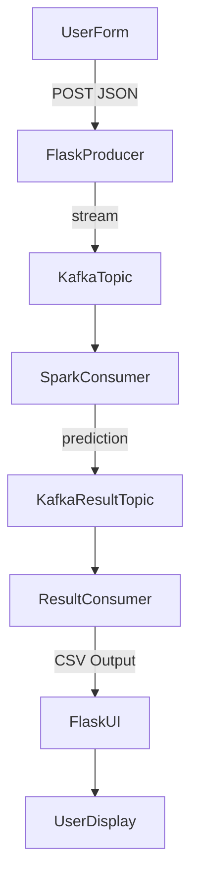

# 💤 Sleep Disorder Prediction - Real-Time Big Data Pipeline

A scalable, cloudless, and real-time system for predicting sleep disorders using user-submitted health and lifestyle data. Built with Apache Kafka, Apache Spark, Flask, Docker, and Ngrok, this project demonstrates end-to-end integration of data streaming, machine learning inference, and result delivery — all locally and in real-time.

## 🚀 Features

- 🔄 Real-time data ingestion with Apache Kafka
- ⚡ Fast, distributed ML inference using Apache Spark
- 📊 Predicts sleep disorder types: **None**, **Insomnia**, **Sleep Apnea**
- 🌐 Web-based UI built with Flask
- 🐳 Fully containerized with Docker & Docker Compose
- 🌍 Remote access enabled via Ngrok tunnel
- 📈 Live stats logging and UI feedback
- ✅ Modular, reproducible, and extendable

## 🧠 Tech Stack

| Component | Technology |
|----------|------------|
| Frontend / Form UI | Flask |
| Stream Transport | Apache Kafka |
| Stream Processing & ML | Apache Spark (Structured Streaming + MLlib) |
| Model Type | Multinomial Logistic Regression (also tested RF, GBT, SVM, Naive Bayes) |
| Containerization | Docker, Docker Compose |
| Public Access | Ngrok |
| Languages | Python, PySpark |
| Dataset | Sleep Health and Lifestyle Dataset (Synthetic - Kaggle) |

## 🧬 Dataset Overview

- **Records**: 374 participants  
- **Features**:
  - Demographic: Age, Gender, Occupation
  - Lifestyle: Sleep Duration, Stress Level, Physical Activity, Daily Steps
  - Health: Heart Rate, BMI, Blood Pressure
- **Target**: `Sleep Disorder` → {None, Insomnia, Sleep Apnea}

## 📊 Model Performance

| Model | Accuracy | Precision | Recall | F1-Score |
|-------|----------|-----------|--------|----------|
| Multinomial Logistic Regression | 0.92 | 0.935 | 0.92 | 0.921 |
| Random Forest | 0.80 | 0.807 | 0.80 | 0.802 |
| GBT | 0.76 | 0.778 | 0.76 | 0.764 |
| SVM | 1.00 | 1.000 | 1.00 | 1.000 |
| Multinomial Naive Bayes | 0.76 | 0.856 | 0.76 | 0.762 |

✅ Logistic Regression was chosen for its balance of speed, accuracy, and Spark MLlib compatibility.

## 🔁 Data Flow



## 📦 Running the Project (Local Setup)

1. **Clone the repo**
   ```bash
   git clone https://github.com/yourusername/sleep-disorder-prediction.git
   cd sleep-disorder-prediction
   ```

2. **Build and run with Docker Compose**
   ```bash
   docker-compose down --volumes --remove-orphans
   docker system prune --volumes --all -f
   docker-compose build --no-cache
   docker-compose up -d
   ```

3. **Expose the UI with Ngrok**
   ```bash
   ngrok http 5000
   ```

4. **Access the web form**
   - Local: [http://localhost:5000](http://localhost:5000)
   - Public: `https://my-ngrok-link.ngrok.io`

## 🧪 How It Works

- Users enter health/lifestyle data via a Flask web form.
- Flask acts as a Kafka producer → sends JSON to a topic.
- Spark Structured Streaming reads the topic, transforms the data, applies ML model.
- Prediction is pushed to a new Kafka topic.
- Kafka Consumer saves prediction to a shared volume (CSV).
- Flask reads this result and shows it back to the user.
- All services run locally via Docker Compose.


## 📚 References

- Dataset: [Kaggle Sleep Health Dataset](https://www.kaggle.com/datasets/uom190346a/sleep-health-and-lifestyle-dataset)
- Tools: Apache Kafka, Apache Spark, Flask, Docker, Ngrok
- Academic Supervision: Dr. Öğr. Üyesi Nur Banu OĞUR

## 👨‍💻 Author

**Elmas İbrahimağa**  
🧑‍🎓 B.Sc. in Software Engineering, Sakarya University  
📧 elmas.ibrahimaga@ogr.sakarya.edu.tr  
🔗 [LinkedIn](www.linkedin.com/in/elmas-ibrahimaga)

## ⭐️ License

This project is for academic and educational purposes.  
MIT License .
